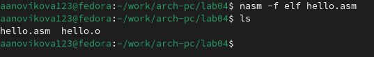
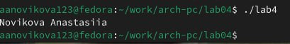

---
## Front matter
title: "Отчёт по лабораторной работе №4"
subtitle: "Создание и процесс обработки программ на языке ассемблера NASM"
author: "Новикова Анастасия Андреевна"

## Generic otions
lang: ru-RU
toc-title: "Содержание"

## Bibliography
bibliography: bib/cite.bib
csl: pandoc/csl/gost-r-7-0-5-2008-numeric.csl

## Pdf output format
toc: true # Table of contents
toc-depth: 2
lof: true # List of figures
lot: true # List of tables
fontsize: 12pt
linestretch: 1.5
papersize: a4
documentclass: scrreprt
## I18n polyglossia
polyglossia-lang:
  name: russian
  options:
	- spelling=modern
	- babelshorthands=true
polyglossia-otherlangs:
  name: english
## I18n babel
babel-lang: russian
babel-otherlangs: english
## Fonts
mainfont: IBM Plex Serif
romanfont: IBM Plex Serif
sansfont: IBM Plex Sans
monofont: IBM Plex Mono
mathfont: STIX Two Math
mainfontoptions: Ligatures=Common,Ligatures=TeX,Scale=0.94
romanfontoptions: Ligatures=Common,Ligatures=TeX,Scale=0.94
sansfontoptions: Ligatures=Common,Ligatures=TeX,Scale=MatchLowercase,Scale=0.94
monofontoptions: Scale=MatchLowercase,Scale=0.94,FakeStretch=0.9
mathfontoptions:
## Biblatex
biblatex: true
biblio-style: "gost-numeric"
biblatexoptions:
  - parentracker=true
  - backend=biber
  - hyperref=auto
  - language=auto
  - autolang=other*
  - citestyle=gost-numeric
## Pandoc-crossref LaTeX customization
figureTitle: "Рис."
tableTitle: "Таблица"
listingTitle: "Листинг"
lofTitle: "Список иллюстраций"
lotTitle: "Список таблиц"
lolTitle: "Листинги"
## Misc options
indent: true
header-includes:
  - \usepackage{indentfirst}
  - \usepackage{float} # keep figures where there are in the text
  - \floatplacement{figure}{H} # keep figures where there are in the text
---

# Цель работы

Освоение процедуры компиляции и сборки программ, написанных на ассемблере NASM

# Задание

Написать программу "Hello, world!" и программу, выводящую имя и фамилию.

# Выполнение лабораторной работы

## Создание программы Hello world!

Создаю каталог для работы с программами на языке ассемблера NASM. Перехожу в созданный каталог. (рис. [-@fig:001]).

{#fig:001 width=70%}

Создаю в текущем каталоге пустой текстовый файл hello.asm и открываю его с помощью текстового редактора gedit (рис. [-@fig:002])

{#fig:002 width=70%}

Начинаю заполнять  файл, вставляя программу для вывода "Hello world!". (рис. [-@fig:003])

{#fig:003 width=70%}

## Работа с транслятором NASM

Превращаю текст программы для вывода "Hello world!" в объектный код с помощью транслятора NASM, используя команду nasm -f elf hello.asm. Ключ -f указывает транслятору NASM, что следует создать бинарный файл в формате ELF. Далее проверяю правильность выполнения команды с помощью ls. Действительно, файл был создан. (рис. [-@fig:004])

{#fig:004 width=70%}

## Работа с расширенным синтаксисом командной строки NASM

Ввожу команду, которая скомпелирует файл hello.asm в файл оbj.o, при этом в файл будут включены символы для отладки (ключ -g), а также с помощью ключа -l будет создан файл листинга list.lst. Далее проверяю командой ls правильность выполнения команд. (рис. [-@fig:005])

{#fig:005 width=70%}

## Работа с компоновщиком LD

Передаю объектный файл hello.o на обработку компоновщику LD, чтобы получить исполняемый файл hello. Ключ -о задаёт имя создаваемого исполняемого файла. Командой ls проверяю правильность выполнения команд. (рис. [-@fig:006])

{#fig:006 width=70%}

Выполняю следующую команду (рис. [-@fig:007]). Исполняемый файл будет иметь имя main, т.к. после ключа -о было задано значение main. Объектный файл, из которого собран этот исполняемый файл, имеет имя obj.o.

{#fig:007 width=70%}

## Запуск исполняемого файла

Запускаю на выполнение созданный исполняемый файл hello. (рис. [-@fig:008])

{#fig:008 width=70%}

## Задание для самостоятельной работы

Создаю копию файла hello.asm с новым именем lab4.asm (рис. @fig:009).

{#fig:009 width=70%}

Открываю файл с помощью текстового редактора и вношу изменения так, чтобы выводились мои имя и фамилия. (рис. [-@fig:010])

{#fig:010 width=70%}

Компилирую текст программы в объектный файл. С помощью команды ls проверяю, что файл lab4.o был создан. (рис. [-@fig:011])

{#fig:011 width=70%}

Передаю объектный файл lab4.o на обработку компоновщику LD, чтобы получить исполняемый файл lab4. (рис. [-@fig:012])

{#fig:012 width=70%}

Запускаю исполняемый файл lab4, на экран действительно выводятся мои имя и фамилия. (рис. [-@fig:013])

{#fig:013 width=70%}

Затем копирую файлы в локальный репозиторий для лабораторных работ. (рис. [-@fig:014])

{#fig:014 width=70%}

Выбираю файлы для загрузки на github с помощью команды git add . , c помощью команды git commit -am комментирую загружаемые файлы и отправляю их на сервер командой git push.

# Выводы

В ходе лабораторной работы были изучены процедуры компиляции и сборки программ на ассемблере NASM.

::: {#refs}
:::
