---
## Front matter
title: "Отчет по лабораторной работе №5"
subtitle: "Основы работы с Midnight Commander"
author: "Новикова Анастасия Андреевна"

## Generic otions
lang: ru-RU
toc-title: "Содержание"

## Bibliography
bibliography: bib/cite.bib
csl: pandoc/csl/gost-r-7-0-5-2008-numeric.csl

## Pdf output format
toc: true # Table of contents
toc-depth: 2
lof: true # List of figures
lot: true # List of tables
fontsize: 12pt
linestretch: 1.5
papersize: a4
documentclass: scrreprt
## I18n polyglossia
polyglossia-lang:
  name: russian
  options:
	- spelling=modern
	- babelshorthands=true
polyglossia-otherlangs:
  name: english
## I18n babel
babel-lang: russian
babel-otherlangs: english
## Fonts
mainfont: IBM Plex Serif
romanfont: IBM Plex Serif
sansfont: IBM Plex Sans
monofont: IBM Plex Mono
mathfont: STIX Two Math
mainfontoptions: Ligatures=Common,Ligatures=TeX,Scale=0.94
romanfontoptions: Ligatures=Common,Ligatures=TeX,Scale=0.94
sansfontoptions: Ligatures=Common,Ligatures=TeX,Scale=MatchLowercase,Scale=0.94
monofontoptions: Scale=MatchLowercase,Scale=0.94,FakeStretch=0.9
mathfontoptions:
## Biblatex
biblatex: true
biblio-style: "gost-numeric"
biblatexoptions:
  - parentracker=true
  - backend=biber
  - hyperref=auto
  - language=auto
  - autolang=other*
  - citestyle=gost-numeric
## Pandoc-crossref LaTeX customization
figureTitle: "Рис."
tableTitle: "Таблица"
listingTitle: "Листинг"
lofTitle: "Список иллюстраций"
lotTitle: "Список таблиц"
lolTitle: "Листинги"
## Misc options
indent: true
header-includes:
  - \usepackage{indentfirst}
  - \usepackage{float} # keep figures where there are in the text
  - \floatplacement{figure}{H} # keep figures where there are in the text
---

# Цель работы

Приобретение практических навыков работы в Midnight Commander. Освоение инструкций языка ассемблера mov и int.

# Задание

1. Основы работы с mc
2. Структура программы на языке ассемблера NASM
3. Подключение внешнего файла
4. Выполнение заданий для самостоятельной работы

# Выполнение лабораторной работы
## Основы работы с mc

Открываю Midnight Commander, введя в терминал mc (рис. [-@fig:001]).

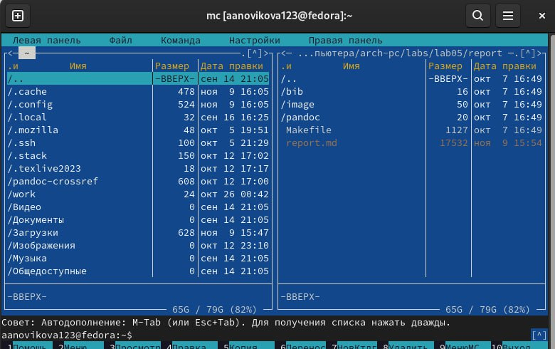{#fig:001 width=70%}

Перехожу в каталог ~/work/arch-pc, используя файловый менеджер mc (рис. [-@fig:002])

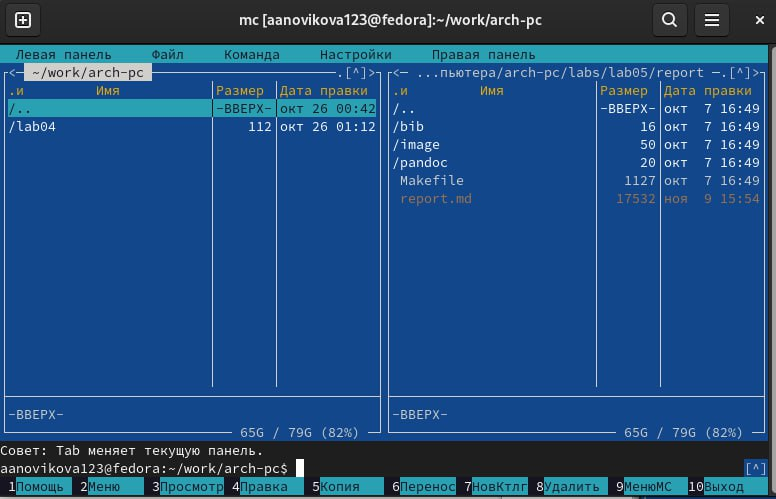{#fig:002 width=70%}

С помощью функциональной клавиши F7 создаю каталог lab05 (рис. [-@fig:003]).

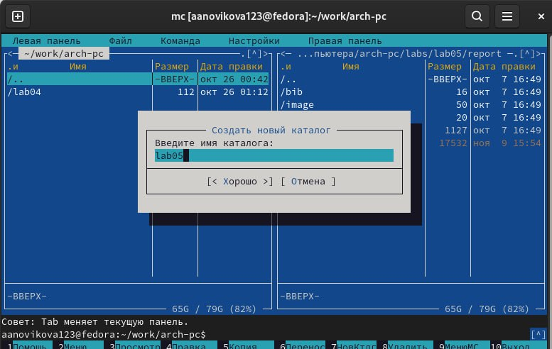{#fig:003 width=70%}

Переходу в созданный каталог (рис. [-@fig:004]).

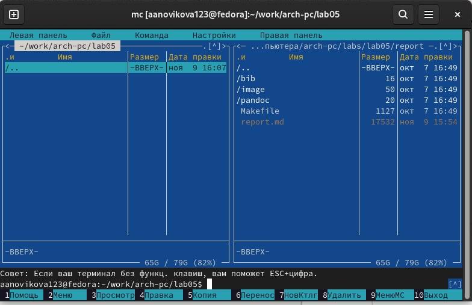{#fig:004 width=70%}

В строке ввода прописываю команду touch lab5-1.asm, чтобы создать файл, в котором буду работать (рис. [-@fig:005]).

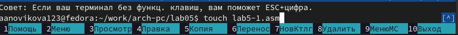{#fig:005 width=70%}

## Структура программы на языке ассемблера NASM

С помощью функциональной клавиши F4 открываю созданный файл для редактирования в редакторе mcedit (рис. [-@fig:006]).

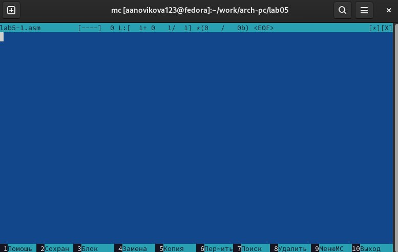{#fig:006 width=70%}

Ввожу в файл код программы для запроса строки у пользователя (рис. [-@fig:007]). Далее клавишей F2 сохраняю изменения и выхожу из файла (клавиша F10).

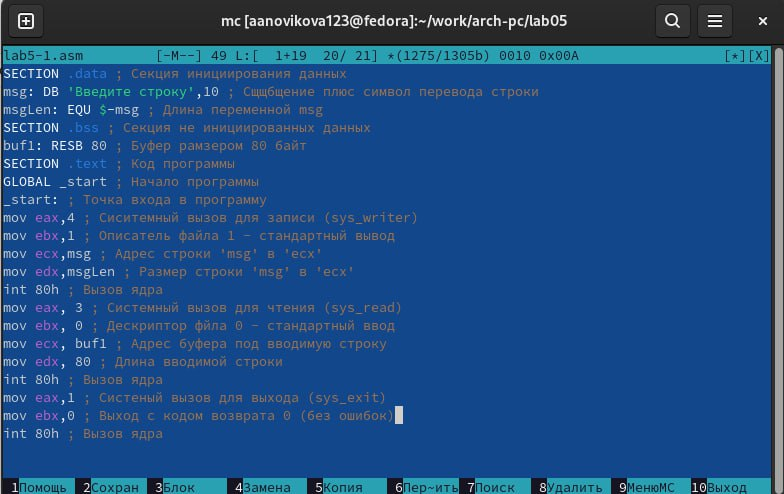{#fig:007 width=70%}

С помощью функциональной клавиши F3 открываю файл для просмотра, чтобы проверить, содержит ли файл текст программы (рис. [-@fig:008]).

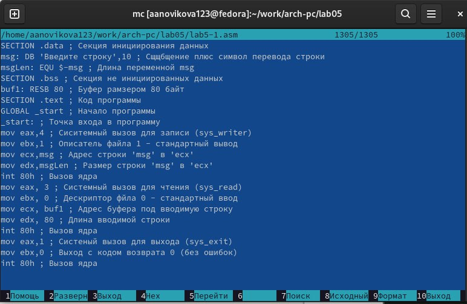{#fig:008 width=70%}

Транслирую текст программы файла в объектный файл командой nasm -f elf lab5-1.asm. (рис. [-@fig:009]) Создался объектный файл lab5-1.o.(рис. [-@fig:010])

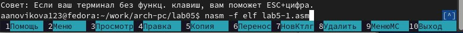{#fig:009 width=70%}

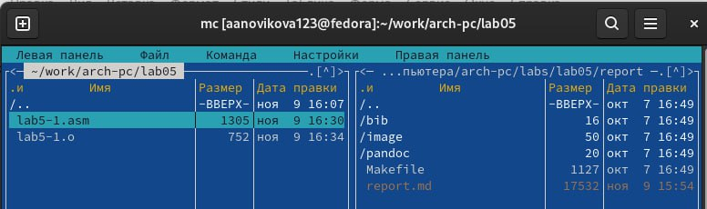{#fig:010 width=70%}
 
Выполняю компоновку объектного файла с помощью команды ld -m elf_i386 -o lab5-1 lab5-1.o (рис. [-@fig:011]). Создался исполняемый файл lab5-1.(рис. [-@fig:012])

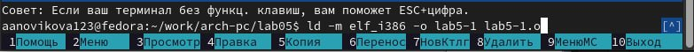{#fig:011 width=70%}

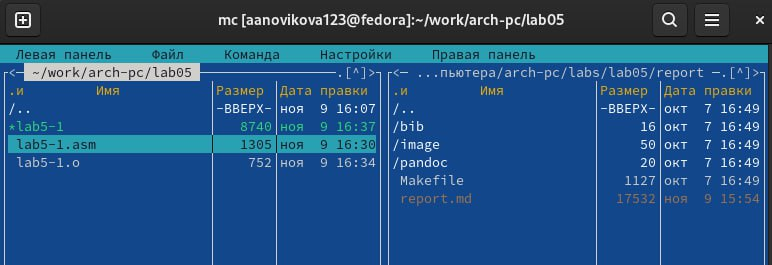{#fig:012 width=70%}

Запускаю исполняемый файл. Программа выводит строку "Введите строку: " и ждет ввода с клавиатуры, я ввожу свои ФИО, на этом программа заканчивает свою работу (рис. [-@fig:013]).

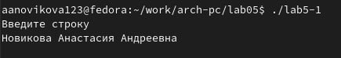{#fig:013 width=70%}

## Подключение внешнего файла

Скачиваю файл in_out.asm со страницы курса в ТУИС. Он сохранился в каталог "Загрузки".
С помощью функциональной клавиши F5 копирую файл in_out.asm из каталога Загрузки в созданный каталог lab05 (рис. [-@fig:014]).

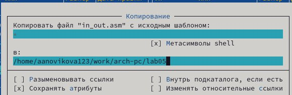{#fig:014 width=70%}

С помощью функциональной клавиши F5 копирую файл lab5-1 в тот же каталог, но с другим именем, для этого в появившемся окне mc прописываю имя для копии файла (рис. [-@fig:015]).

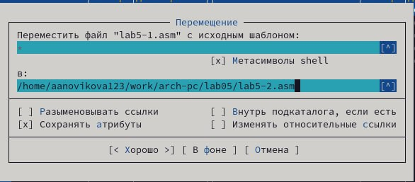{#fig:015 width=70%}

Изменяю содержимое файла lab5-2.asm во встроенном редакторе mcedit (рис. [-@fig:016]), чтобы в программе использовались подпрограммы из внешнего файла in_out.asm.

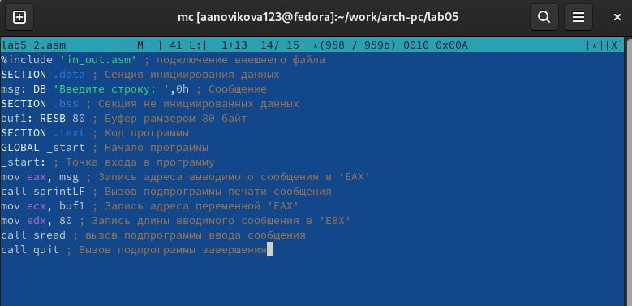{#fig:016 width=70%}

Транслирую текст программы файла в объектный файл командой nasm -f elf lab5-2.asm. Создался объектный файл lab5-2.o. Выполняю компоновку объектного файла с помощью команды ld -m elf_i386 -o lab5-2 lab5-2.o Создался исполняемый файл lab5-2. Запускаю исполняемый файл (рис. [-@fig:017]). 

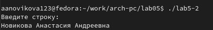{#fig:017 width=70%}

Открываю файл lab5-2.asm для редактирования в mcedit функциональной клавишей F4. Изменяю в нем подпрограмму sprintLF на sprint. Сохраняю изменения.

Снова транслирую файл, выполняю компоновку созданного объектного файла, запускаю новый исполняемый файл (рис. [-@fig:018]).

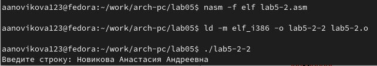{#fig:018 width=70%}

Разница между первым исполняемым файлом lab5-2 и вторым lab5-2-2 в том, что запуск первого запрашивает ввод с новой строки, а программа, которая исполняется при запуске второго, запрашивает ввод без переноса на новую строку, потому что в этом заключается различие между подпрограммами sprintLF и sprint.

## Выполнение заданий для самостоятельной работы

Создаю копию файла lab5-1.asm с именем lab5-1-1.asm с помощью функциональной клавиши F5 (рис. [-@fig:019]).

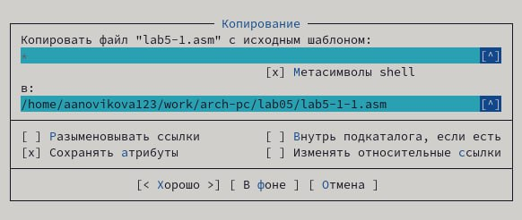{#fig:019 width=70%}

С помощью функциональной клавиши F4 открываю созданный файл для редактирования. Изменяю программу так, чтобы кроме вывода приглашения и запроса ввода, она выводила вводимую пользователем строку (рис. [-@fig:020]). 

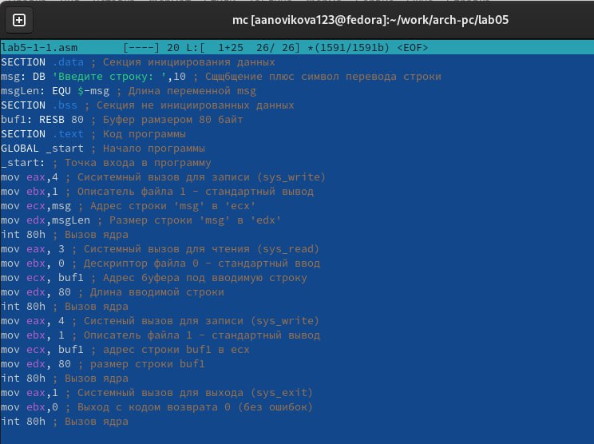{#fig:020 width=70%}

Создаю объектный файл lab5-1-1.o, отдаю его на обработку компоновщику, получаю исполняемый файл lab5-1-1, запускаю полученный исполняемый файл. Программа запрашивает ввод, ввожу свои ФИО, далее программа выводит введенные мною данные (рис. [-@fig:021]).
 
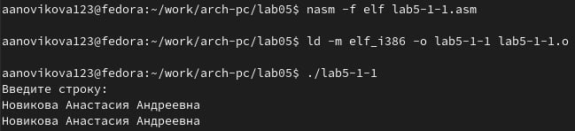{#fig:021 width=70%}

Код программы:

```NASM
SECTION .data ; Секция инициированных данных
msg: DB 'Введите строку:',10
msgLen: EQU $-msg ; Длина переменной 'msg'
SECTION .bss ; Секция не инициированных данных
buf1: RESB 80 ; Буфер размером 80 байт
SECTION .text ; Код программы
GLOBAL _start ; Начало программы
_start: ; Точка входа в программу
mov eax,4 ; Системный вызов для записи (sys_write)
mov ebx,1 ; Описатель файла 1 - стандартный вывод
mov ecx,msg ; Адрес строки 'msg' в 'ecx'
mov edx,msgLen ; Размер строки 'msg' в 'edx'
int 80h ; Вызов ядра
mov eax, 3 ; Системный вызов для чтения (sys_read)
mov ebx, 0 ; Дескриптор файла 0 - стандартный ввод
mov ecx, buf1 ; Адрес буфера под вводимую строку
mov edx, 80 ; Длина вводимой строки
int 80h ; Вызов ядра
mov eax,4 ; Системный вызов для записи (sys_write)
mov ebx,1 ; Описатель файла '1' - стандартный вывод
mov ecx,buf1 ; Адрес строки buf1 в ecx
mov buf1, 80 ; Размер строки buf1
int 80h ; Вызов ядра
mov eax,1 ; Системный вызов для выхода (sys_exit)
mov ebx,0 ; Выход с кодом возврата 0 (без ошибок)
int 80h ; Вызов ядра
```

Создаю копию файла lab5-2.asm с именем lab5-2-1.asm с помощью функциональной клавиши F5 (рис. [-@fig:022]).

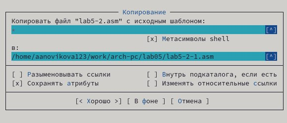{#fig:022 width=70%}

С помощью функциональной клавиши F4 открываю созданный файл для редактирования. Изменяю программу так, чтобы кроме вывода приглашения и запроса ввода, она выводила вводимую пользователем строку (рис. [-@fig:023]). 

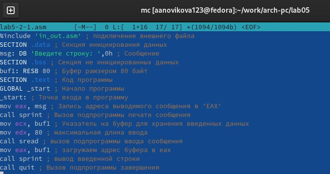{#fig:023 width=70%}

Создаю объектный файл lab5-2-1.o, отдаю его на обработку компоновщику, получаю исполняемый файл lab5-2-1, запускаю полученный исполняемый файл. Программа запрашивает ввод без переноса на новую строку, ввожу свои ФИО, далее программа выводит введенные мною данные (рис. [-@fig:024]).

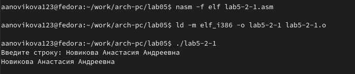{#fig:024 width=70%}

Код программы:

```NASM
%include 'in_out.asm'
SECTION .data ; Секция инициированных данных
msg: DB 'Введите строку: ',0h ; сообщение
SECTION .bss ; Секция не инициированных данных
buf1: RESB 80 ; Буфер размером 80 байт
SECTION .text ; Код программы
GLOBAL _start ; Начало программы
_start: ; Точка входа в программу
mov eax, msg ; запись адреса выводимого сообщения в `EAX`
call sprint ; вызов подпрограммы печати сообщения
mov ecx, buf1 ; указатель на буфер для хранения введенных данных
mov edx, 80 ; максимальная длина ввода
call sread ; вызов подпрограммы ввода сообщения
mov eax, buf1; загружаем адрес буфера в eax
call sprint ; вывод введенной строки
call quit ; вызов подпрограммы завершения
```

# Выводы

При выполнении данной лабораторной работы освоены практические навыки работы в Midnight Commander, а также инструкции языка ассемблера mov и int.

::: {#refs}
:::
