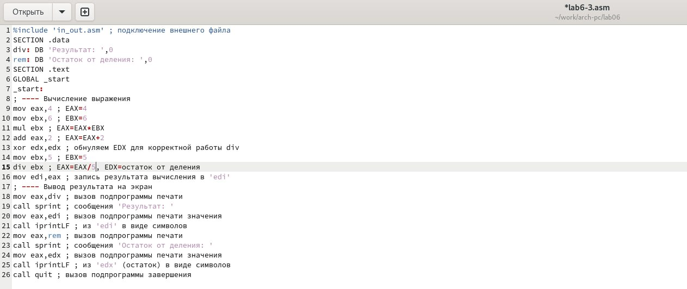
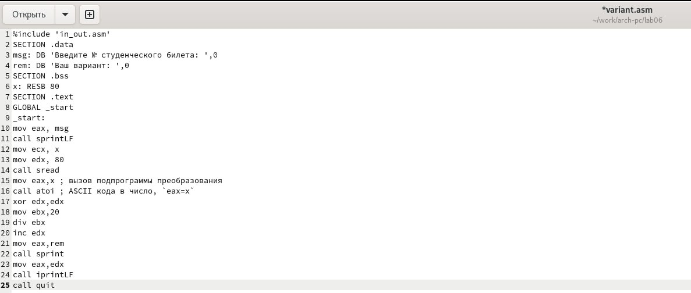
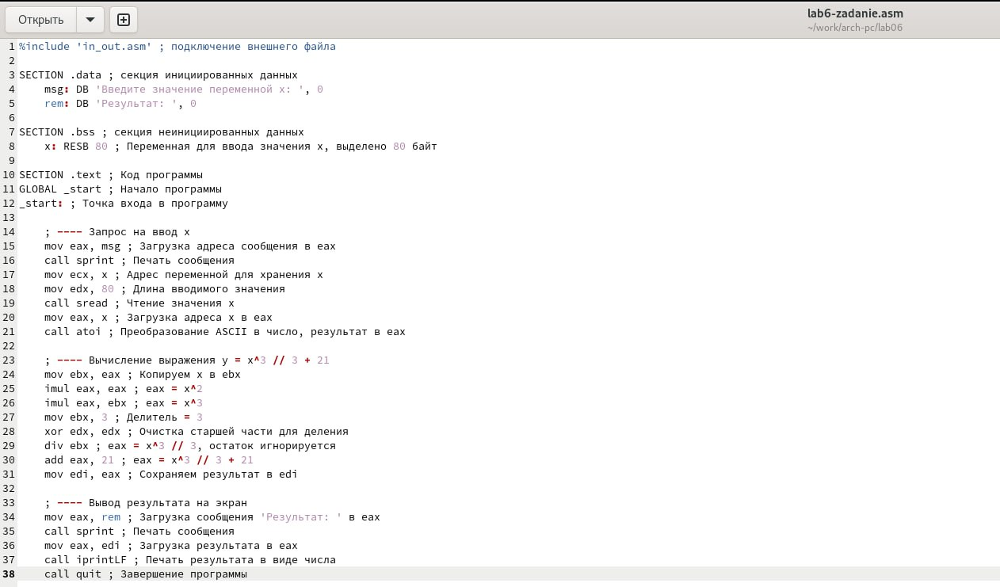

---
## Front matter
title: "Отчёт по лабораторной работе №6"
subtitle: "Арифметические операция в NASM"
author: "Новикова Анастасия Андреевна"

## Generic otions
lang: ru-RU
toc-title: "Содержание"

## Bibliography
bibliography: bib/cite.bib
csl: pandoc/csl/gost-r-7-0-5-2008-numeric.csl

## Pdf output format
toc: true # Table of contents
toc-depth: 2
lof: true # List of figures
lot: true # List of tables
fontsize: 12pt
linestretch: 1.5
papersize: a4
documentclass: scrreprt
## I18n polyglossia
polyglossia-lang:
  name: russian
  options:
	- spelling=modern
	- babelshorthands=true
polyglossia-otherlangs:
  name: english
## I18n babel
babel-lang: russian
babel-otherlangs: english
## Fonts
mainfont: IBM Plex Serif
romanfont: IBM Plex Serif
sansfont: IBM Plex Sans
monofont: IBM Plex Mono
mathfont: STIX Two Math
mainfontoptions: Ligatures=Common,Ligatures=TeX,Scale=0.94
romanfontoptions: Ligatures=Common,Ligatures=TeX,Scale=0.94
sansfontoptions: Ligatures=Common,Ligatures=TeX,Scale=MatchLowercase,Scale=0.94
monofontoptions: Scale=MatchLowercase,Scale=0.94,FakeStretch=0.9
mathfontoptions:
## Biblatex
biblatex: true
biblio-style: "gost-numeric"
biblatexoptions:
  - parentracker=true
  - backend=biber
  - hyperref=auto
  - language=auto
  - autolang=other*
  - citestyle=gost-numeric
## Pandoc-crossref LaTeX customization
figureTitle: "Рис."
tableTitle: "Таблица"
listingTitle: "Листинг"
lofTitle: "Список иллюстраций"
lotTitle: "Список таблиц"
lolTitle: "Листинги"
## Misc options
indent: true
header-includes:
  - \usepackage{indentfirst}
  - \usepackage{float} # keep figures where there are in the text
  - \floatplacement{figure}{H} # keep figures where there are in the text
---

# Цель работы

Освоение арифметических инструкций языка ассемблера NASM.

# Задание

1. Символьные и численные данные в NASM
2. Выполнение арифметических операций в NASM
3. Выполнение заданий для самостоятельной работы

# Выполнение лабораторной работы

## Символьные и численные данные в NASM

С помощью команды mkdir создаю директорию, в которой буду создавать файлы с программами для лабораторной работы №6 (рис. [-@fig:001]). Перехожу в созданный каталог с помощью команды cd.

{#fig:001 width=70%}

С помощью команды touch создаю файл lab6-1.asm (рис. [-@fig:002]).

{#fig:002 width=70%}

Копирую в текущий каталог файл in_out.asm с помощью команды cp, т.к. он будет использоваться в других программах (рис. [-@fig:003]).

{#fig:003 width=70%}

Открываю созданный файл lab6-1.asm, вставляю в него программу вывода значения регистра eax (рис. [-@fig:004]).

{#fig:004 width=70%}

Создаю исполняемый файл программы и запускаю его (рис. [-@fig:005]). Вывод программы: символ j, потому что программа вывела символ, соответствующий по системе ASCII сумме двоичных кодов символов 4 и 6.

{#fig:005 width=70%}

Изменяю в тексте программы символы "6" и "4" на цифры 6 и 4 (рис. [-@fig:006]). 

{#fig:006 width=70%}

Создаю новый исполняемый файл программы и запускаю его (рис. [-@fig:007]). Теперь вывелся символ с кодом 10, это символ перевода строки, этот символ не отображается при выводе на экран.

{#fig:007 width=70%}

Создаю новый файл lab6-2.asm с помощью команды touch (рис. [-@fig:008]).

{#fig:008 width=70%}

Ввожу в файл текст другой программы для вывода значения регистра eax (рис. [-@fig:009]).

{#fig:009 width=70%}

Создаю и запускаю исполняемый файл lab6-2 (рис. [-@fig:010]). Теперь выводится число 106, потому что программа позволяет вывести именно число, а не символ, хотя все еще происходит именно сложение кодов символов "6" и "4" (54 + 52 = 106).

{#fig:010 width=70%}

Заменяю в тексте программы в файле lab6-2.asm символы "6" и "4" на числа 6 и 4 (рис. [-@fig:011]).

{#fig:011 width=70%}

Создаю и запускаю новый исполняемый файл (рис. [-@fig:012]). Теперь программа складывает не соответствующие символам коды в системе ASCII, а сами числа, поэтому вывод 10.

{#fig:012 width=70%}

Заменяю в тексте программы функцию iprintLF на iprint (рис. [-@fig:013]).

{#fig:013 width=70%}

Создаю и запускаю новый исполняемый файл (рис. [-@fig:014]). Вывод значения не изменился, но курсор остался на той же строке. То есть функция iprintLF переводит курсор на следующую строку, а iprint не добавляет к выводу символ переноса строки.

{#fig:014 width=70%}

## Выполнение арифметических операций в NASM

Создаю файл lab6-3.asm с помощью команды touch (рис. [-@fig:015]).

{#fig:015 width=70%}

Ввожу в созданный файл текст программы для вычисления значения выражения f(x) = (5 * 2 + 3)/3 (рис. [-@fig:016]).

{#fig:016 width=70%}

Создаю исполняемый файл и запускаю его (рис. [-@fig:017]).

{#fig:017 width=70%}

Изменяю программу так, чтобы она вычисляла значение выражения f(x) = (4 * 6 + 2)/5 (рис. [-@fig:018]). 

{ #fig:018 width=70% }

Создаю и запускаю новый исполняемый файл (рис. [-@fig:019]). Я посчитала для проверки правильности работы программы значение выражения самостоятельно, программа отработала верно.

{ #fig:019 width=70% }

Создаю файл variant.asm с помощью команды touch (рис. [-@fig:020]).

{#fig:020 width=70%}

Ввожу в файл текст программы для вычисления варианта задания по номеру студенческого билета (рис. [-@fig:021]).

{#fig:021 width=70%}

Создаю и запускаю исполняемый файл (рис. [-@fig:022]). Ввожу номер своего студ. билета с клавиатуры, программа вывела, что мой вариант - 20.

{#fig:022 width=70%}

Я проверила аналитически, действительно, 1132246839/20 + 1 = 20. Остаток от деления 1132246839 на 20 равен 19, 19 + 1 = 20.

### Ответы на вопросы по программе

1. За вывод сообщения "Ваш вариант" отвечают строки кода:

```NASM
mov eax,rem
call sprint
```
2. Инструкция mov ecx, x используется, чтобы положить адрес вводимой строки x в регистр ecx.
mov edx, 80 - запись в регистр edx длины вводимой строки. 
call sread - вызов подпрограммы из внешнего файла, обеспечивающей ввод сообщения с клавиатуры. 

3. call atoi используется для вызова подпрограммы из внешнего файла, которая преобразует ASCII-код символа в целое число и записывает результат в регистр eax.

4. За вычисления варианта отвечают строки:

```NASM
xor edx,edx ; обнуление edx для корректной работы div
mov ebx,20 ; ebx = 20
div ebx ; eax = eax/20, edx - остаток от деления
inc edx ; edx = edx + 1
```

5. При выполнении инструкции div ebx остаток от деления записывается в регистр edx

6. Инструкция inc edx увеличивает значение регистра edx на 1

7. За вывод на экран результатов вычислений отвечают строки:

```NASM
mov eax,edx
call iprintLF
```

## Выполнение заданий для самостоятельной работы

Создаю файл lab6-zadanie.asm с помощью команды touch (рис. [-@fig:023]).

{#fig:023 width=70%}

Открываю созданный файл для редактирования, ввожу в него текст программы для вычисления значения выражения x^3 * 1/3 + 21 (рис. [-@fig:024]). Это выражение было под вариантом 20.

{#fig:024 width=70%}

Создаю и запускаю исполняемый файл (рис. [-@fig:025]). При вводе значения 1, вывод - 21. Так как 1^3 = 1. Остаток от деления на 3 равен 0. Значит, 0 + 21 = 21. Программа отработала верно.

{#fig:025 width=70%}

Провожу еще один запуск исполняемого файла для проверки работы программы с другим значением на входе (рис. [-@fig:026]). Программа отработала верно. 3^3 = 27. 27/3 = 9. 9 + 21 = 30.

{#fig:026 width=70%}

**Листинг 4.1. Программа для вычисления значения выражения x^3 * 1/3 + 21.**

```NASM
%include 'in_out.asm' ; подключение внешнего файла

SECTION .data ; секция инициированных данных
    msg: DB 'Введите значение переменной х: ', 0
    rem: DB 'Результат: ', 0

SECTION .bss ; секция неинициированных данных
    x: RESB 80 ; Переменная для ввода значения x, выделено 80 байт

SECTION .text ; Код программы
GLOBAL _start ; Начало программы
_start: ; Точка входа в программу

    ; ---- Запрос на ввод x
    mov eax, msg ; Загрузка адреса сообщения в eax
    call sprint ; Печать сообщения
    mov ecx, x ; Адрес переменной для хранения x
    mov edx, 80 ; Длина вводимого значения
    call sread ; Чтение значения x
    mov eax, x ; Загрузка адреса x в eax
    call atoi ; Преобразование ASCII в число, результат в eax

    ; ---- Вычисление выражения y = x^3 // 3 + 21
    mov ebx, eax ; Копируем x в ebx
    imul eax, eax ; eax = x^2
    imul eax, ebx ; eax = x^3
    mov ebx, 3 ; Делитель = 3
    xor edx, edx ; Очистка старшей части для деления
    div ebx ; eax = x^3 // 3, остаток игнорируется
    add eax, 21 ; eax = x^3 // 3 + 21
    mov edi, eax ; Сохраняем результат в edi

    ; ---- Вывод результата на экран
    mov eax, rem ; Загрузка сообщения 'Результат: ' в eax
    call sprint ; Печать сообщения
    mov eax, edi ; Загрузка результата в eax
    call iprintLF ; Печать результата в виде числа
    call quit ; Завершение программы
```

# Выводы

При выполнении данной лабораторной работы были освоены арифметические инструкции языка ассемблера NASM.


::: {#refs}
:::
