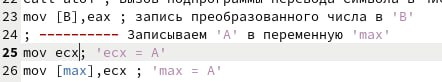

---
## Front matter
title: "Отчёт по лабораторной работе №7"
subtitle: "Команды безусловного и условного перехода в NASM. Программирование ветвлений"
author: "Новикова Анастасия Андреевна"

## Generic otions
lang: ru-RU
toc-title: "Содержание"

## Bibliography
bibliography: bib/cite.bib
csl: pandoc/csl/gost-r-7-0-5-2008-numeric.csl

## Pdf output format
toc: true # Table of contents
toc-depth: 2
lof: true # List of figures
lot: true # List of tables
fontsize: 12pt
linestretch: 1.5
papersize: a4
documentclass: scrreprt
## I18n polyglossia
polyglossia-lang:
  name: russian
  options:
	- spelling=modern
	- babelshorthands=true
polyglossia-otherlangs:
  name: english
## I18n babel
babel-lang: russian
babel-otherlangs: english
## Fonts
mainfont: IBM Plex Serif
romanfont: IBM Plex Serif
sansfont: IBM Plex Sans
monofont: IBM Plex Mono
mathfont: STIX Two Math
mainfontoptions: Ligatures=Common,Ligatures=TeX,Scale=0.94
romanfontoptions: Ligatures=Common,Ligatures=TeX,Scale=0.94
sansfontoptions: Ligatures=Common,Ligatures=TeX,Scale=MatchLowercase,Scale=0.94
monofontoptions: Scale=MatchLowercase,Scale=0.94,FakeStretch=0.9
mathfontoptions:
## Biblatex
biblatex: true
biblio-style: "gost-numeric"
biblatexoptions:
  - parentracker=true
  - backend=biber
  - hyperref=auto
  - language=auto
  - autolang=other*
  - citestyle=gost-numeric
## Pandoc-crossref LaTeX customization
figureTitle: "Рис."
tableTitle: "Таблица"
listingTitle: "Листинг"
lofTitle: "Список иллюстраций"
lotTitle: "Список таблиц"
lolTitle: "Листинги"
## Misc options
indent: true
header-includes:
  - \usepackage{indentfirst}
  - \usepackage{float} # keep figures where there are in the text
  - \floatplacement{figure}{H} # keep figures where there are in the text
---

# Цель работы

Изучение команд условного и безусловного переходов. Приобретение навыков написания
программ с использованием переходов. Знакомство с назначением и структурой файла
листинга.

# Задание

1. Реализация переходов в NASM.
2. Изучение структуры файлы листинга.
3. Задания для самостоятельной работы.

# Выполнение лабораторной работы

## Реализация переходов в NASM

Создаю каталог для программ лабораторной работы № 7, перехожу в него и создаю файл lab7-1.asm. (рис. [-@fig:001]).

{#fig:001 width=70%}

Ввожу в файл lab7-1.asm текст программы из листинга 7.1. ((рис. [-@fig:002]).

{#fig:002 width=70%}

Создаю исполняемый файл и запускаю его. ((рис. [-@fig:003])

{#fig:003 width=70%}

Таким образом, использование инструкции jmp _label2 меняет порядок исполнения
инструкций и позволяет выполнить инструкции начиная с метки _label2, пропустив вывод
первого сообщения.

Изменю программу таким образом, чтобы она выводила сначала ‘Сообщение № 2’, потом ‘Сообщение № 1’ и завершала работу. Для этого изменяю текст программы в соответствии с листингом 7.2. ((рис. [-@fig:004])

{#fig:004 width=70%}

Создаю исполняемый файл и проверяю его работу. (рис. [-@fig:005])

{#fig:005 width=70%}

Затем изменяю текст программы, добавив в начале программы jmp _label3, jmp _label2 в конце метки jmp _label3, jmp _label1 добавляю в конце метки jmp _label2, и добавляю jmp _end в конце метки jmp _label1, (рис. [-@fig:006])

{#fig:006 width=70%}

чтобы вывод программы был следующим: (рис. [-@fig:007])

{#fig:007 width=70%}

Рассмотрим программу, которая определяет и выводит на экран наибольшую из 3 целочисленных переменных: A,B и C. Значения для A и C задаются в программе, значение B вводиться с клавиатуры.

Создаю файл lab7-2.asm в каталоге ~/work/arch-pc/lab07. (рис. [-@fig:008])

{#fig:008 width=70%}

Текст программы из листинга 7.3 ввожу в lab7-2.asm. ((рис. [-@fig:009])

{#fig:009 width=70%}

Создаю исполняемый файл и проверьте его работу. (рис. [-@fig:010])

{#fig:010 width=70%}

Файл работает корректно.

## Изучение структуры файлы листинга

Создаю файл листинга для программы из файла lab7-2.asm. (рис. [-@fig:011])

{#fig:011 width=70%}

Открываю файл листинга lab7-2.lst с помощью текстового редактора и внимательно изучаю его формат и содержимое. (рис. [-@fig:012])

{#fig:012 width=70%}

В представленных трех строчках содержаться следующие данные: ((рис. [-@fig:013])

{#fig:013 width=70%}

"2" - номер строки кода, "; Функция вычисления длинны сообщения" - комментарий к коду, не имеет адреса и машинного кода.

"3" - номер строки кода, "slen" - название функции, не имеет адреса и машинного кода.

"4" - номер строки кода, "00000000" - адрес строки, "53" - машинный код, "push ebx" - исходный текст программы, инструкция "push" помещает операнд "ebx" в стек.

Открываю файл с программой lab7-2.asm и в выбранной мной инструкции с двумя операндами удаляю выделенный операнд. (рис. [-@fig:014])

{#fig:014 width=70%}

Выполняю трансляцию с получением файла листинга. (рис. [-@fig:015])

{#fig:015 width=70%}

Терминал выводит сообщение об ошибке: инструкция mov не может работать, имея только один операнд, из-за чего нарушается работа кода.

Ознакамливаюсь с новым файлом листинга. В файле в этой строчке ошибка. (рис. [-@fig:016]) 

{#fig:016 width=70%}

## Задания для самостоятельной работы

*Вариант 20*

*Задание 1*

Пишу программу нахождения наименьшей из 3 целочисленных переменных a, b и c.
Значения переменных выбираю из табл. 7.5 в соответствии с вариантом, полученным при выполнении лабораторной работы № 6. Мой вариант под номером 20, поэтому мои значения - 95, 2, 61. (рис. [-@fig:017])

{#fig:017 width=70%}

Создаю исполняемый файл и проверяю его работу, подставляя необходимые значение. (рис. [-@fig:018])

{#fig:018 width=70%}

Программа работает корректно.

Код программы:

```NASM
%include 'in_out.asm'

section .data
    msg db "Наименьшее число: ", 0
    A dd 95 
    B dd 2 
    C dd 61 

section .bss
    min resd 1 ; Переменная для хранения наименьшего значения (32-битная)

section .text
global _start

_start:
    ; Инициализируем min значением A
    mov eax, [A] ; Загружаем A в eax
    mov [min], eax ; Сохраняем A в min

    ; Сравниваем min и B
    mov ebx, [B] ; Загружаем B в ebx
    cmp eax, ebx ; Сравниваем min (eax) и B
    jle _compare_c ; Если min <= B, идем к сравнению с C
    mov [min], ebx ; Иначе B становится наименьшим

_compare_c:
    ; Сравниваем min и C
    mov ecx, [C] ; Загружаем C в ecx
    mov eax, [min] ; Загружаем min в eax
    cmp eax, ecx ; Сравниваем min и C
    jle _end ; Если min <= C, завершаем
    mov [min], ecx ; Иначе C становится наименьшим

_end:
    ; Выводим сообщение
    mov eax, msg
    call sprint

    ; Выводим значение min
    mov eax, [min] ; Загружаем значение min в eax
    call iprintLF

    ; Завершаем программу
    call quit
```

*Задание 2*

Пишу программу (рис. [-@fig:019]), которая для введенных с клавиатуры значений х и а вычисляет значение и выводит результат вычислений заданной для моего варианта функции f(x): 
*x - a, если x >= a;*

*5, если x < a*. 

{#fig:019 width=70%}

Создаю исполняемый файл и проверяю его работу для значений х и а соответственно: (1, 2), (2, 1). (рис. [-@fig:020])

{#fig:020 width=70%}

Программа работает корректно.

Код программы:

```NASM
%include 'in_out.asm'

section .data
    msg1 db "Введите a: ", 0
    msg2 db "Введите x: ", 0
    msg3 db "F(x) = ", 0

section .bss
    a resb 80 
    x resb 80
    res resb 80

section .text
global _start

_start:
    ; --- Ввод a ---
    mov eax, msg1  ; Вывод сообщения "Введите a:"
    call sprint
    mov ecx, a     ; Адрес для сохранения a
    mov edx, 10    ; Максимальная длина ввода
    call sread
    mov eax, a     ; Преобразование строки в число
    call atoi
    mov [a], eax   ; Запись преобразованного числа в а

    ; --- Ввод x ---
    mov eax, msg2 ; Вывод сообщения "Введите x:"
    call sprint
    mov ecx, x    ; Адрес для сохранения x
    mov edx, 10   ; Максимальная длина ввода
    call sread
    mov eax, x    ; Преобразование строки в число
    call atoi
    mov [x], eax  ; Запись преобразованного числа в х

    ; --- Вычисление функции ---
    mov eax, [x] ; Загружаем x в eax
    mov ebx, [a] ; Загружаем a в ebx
    cmp eax, ebx ; Сравниваем x и a
    jl _less_than_a ; Если x < a, перейти к соответствующей ветке

    ; если x >= a, то res = x - a
    sub eax, ebx     ; eax = eax - ebx (res = x - a)
    mov [res], eax   ; Сохраняем результат
    jmp _print_result ; Переход к выводу результата

_less_than_a:
    ; если x < a, то res = 5
    mov eax, 5 ; res = 5
    mov [res], eax ; Сохраняем результат

_print_result:
    ; --- Вывод результата ---
    mov eax, msg3 ; Вывод сообщения
    call sprint
    mov eax, [res]  ; Загружаем результат
    call iprintLF   ; Выводим результат
    call quit       ; Завершаем программу
```

# Выводы

По итогам данной лабораторной работы были изучены команды условного и безусловного переходов, приобретены навыки написания программ с использованием переходов, а также было знакомство с назначением и структурой файла листинга.


::: {#refs}
:::
