---
## Front matter
title: "Отчёт по лабораторной работе №8"
subtitle: "Программирование цикла. Обработка аргументов командной строки"
author: "Новикова Анастасия Андреевна"

## Generic otions
lang: ru-RU
toc-title: "Содержание"

## Bibliography
bibliography: bib/cite.bib
csl: pandoc/csl/gost-r-7-0-5-2008-numeric.csl

## Pdf output format
toc: true # Table of contents
toc-depth: 2
lof: true # List of figures
lot: true # List of tables
fontsize: 12pt
linestretch: 1.5
papersize: a4
documentclass: scrreprt
## I18n polyglossia
polyglossia-lang:
  name: russian
  options:
	- spelling=modern
	- babelshorthands=true
polyglossia-otherlangs:
  name: english
## I18n babel
babel-lang: russian
babel-otherlangs: english
## Fonts
mainfont: IBM Plex Serif
romanfont: IBM Plex Serif
sansfont: IBM Plex Sans
monofont: IBM Plex Mono
mathfont: STIX Two Math
mainfontoptions: Ligatures=Common,Ligatures=TeX,Scale=0.94
romanfontoptions: Ligatures=Common,Ligatures=TeX,Scale=0.94
sansfontoptions: Ligatures=Common,Ligatures=TeX,Scale=MatchLowercase,Scale=0.94
monofontoptions: Scale=MatchLowercase,Scale=0.94,FakeStretch=0.9
mathfontoptions:
## Biblatex
biblatex: true
biblio-style: "gost-numeric"
biblatexoptions:
  - parentracker=true
  - backend=biber
  - hyperref=auto
  - language=auto
  - autolang=other*
  - citestyle=gost-numeric
## Pandoc-crossref LaTeX customization
figureTitle: "Рис."
tableTitle: "Таблица"
listingTitle: "Листинг"
lofTitle: "Список иллюстраций"
lotTitle: "Список таблиц"
lolTitle: "Листинги"
## Misc options
indent: true
header-includes:
  - \usepackage{indentfirst}
  - \usepackage{float} # keep figures where there are in the text
  - \floatplacement{figure}{H} # keep figures where there are in the text
---

# Цель работы

Приобретение навыков написания программ с использованием циклов и обработкой
аргументов командной строки.

# Задание

1. Реализация циклов в NASM
2. Обработка аргументов командной строки
3. Задание для самостоятельной работы

# Выполнение лабораторной работы
## Реализация циклов в NASM

Создаю директорию, в которой буду выполнять лабораторную работу, перехожу в созданный каталог и создаю файл lab8-1.asm, в котором буду выполнять первое задание (рис. [-@fig:001]).

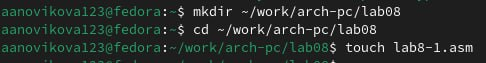{#fig:001 width=70%}

Ввожу текст кода из листинга 8.1 ((рис. [-@fig:002]). Эта программа запрашивает число N и выдает все числа перед N вместе с ним до 0 не включительно.

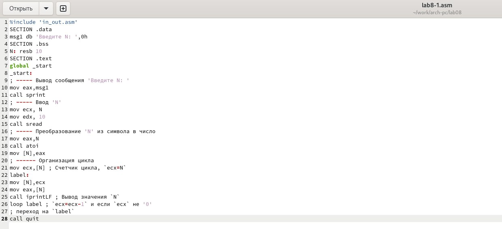{#fig:002 width=70%}

Создаю исполняемый код (рис. [-@fig:003]). После его запуска убеждаюсь, что программа работает успешно.

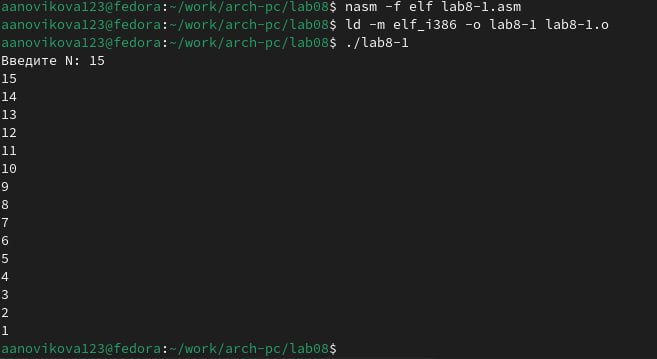{#fig:003 width=70%}

Теперь я редактирую код, добавив изменение значение регистра ecx в цикле (рис. [-@fig:004])

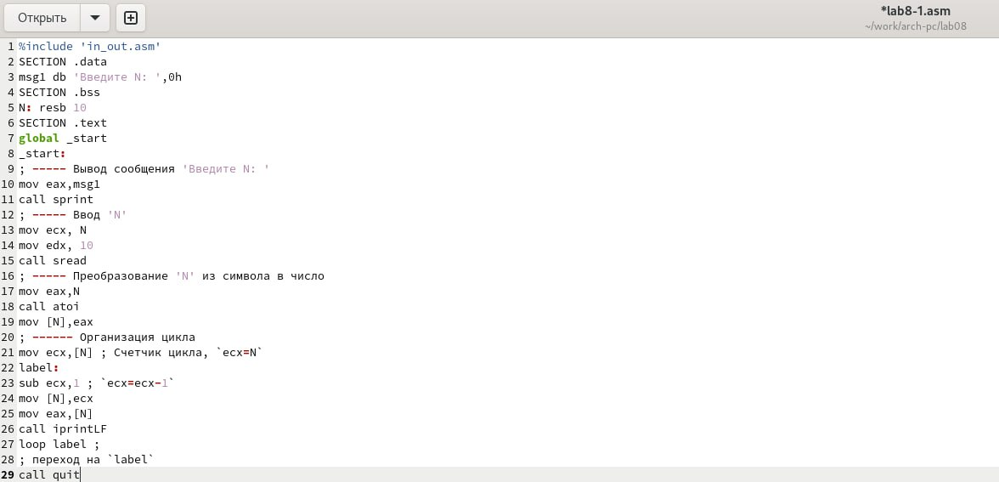{#fig:004 width=70%}

Запускаю программу. Теперь код передаёт значение через 2 числа. Регистр ecx принимает значения 9, 7, 3, 5, 1. Число проходов по циклу не равно N. (рис. [-@fig:005])

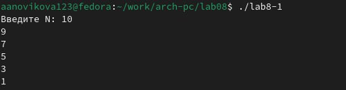{#fig:005 width=70%}

Еще раз редактирую код программы, добавив команды push и pop (добавления в стек и извлечения из стека) для сохранения значения счетчика цикла loop (рис. [-@fig:006]).

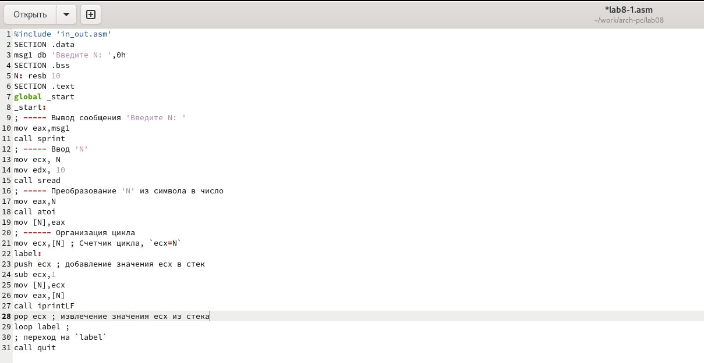{#fig:006 width=70%}

Создаю и запускаю исполняемый файл (рис. [-@fig:007]). Теперь программа показывает все предыдущие числа до 0, не включая заданное N. Число проходов по циклу равно N.

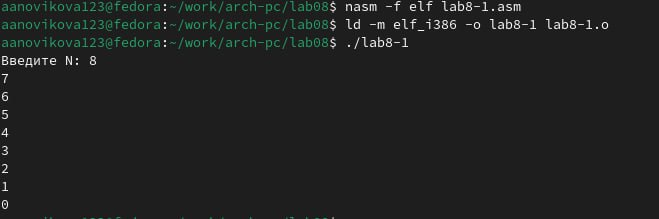{#fig:007 width=70%}

## Обработка аргументов командной строки

Создаю новый файл lab8-2.asm и ввожу в него код из листинга 8.2 (рис. [-@fig:008]). Данная программа позволяет выводить на экран аргументы командной строки.

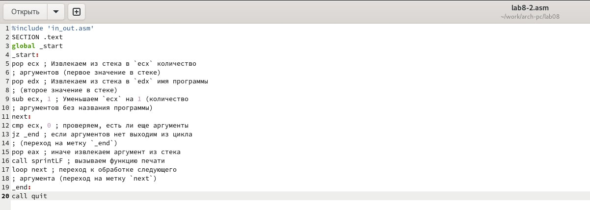{#fig:008 width=70%}

Запускаю исполняемый файл вместе с аргументами (аргумент1 аргумент 2 'аргумент 3') (рис. [-@fig:009]). Программа обработала 4 аргумента: аргумент1 - 1-ый аргумент, аргумент - 2-ой аргумент, 2 - 3-ий аргумент, 'аргумент 3' - 4-ый аргумент.

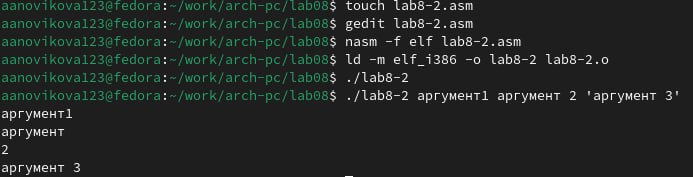{#fig:009 width=70%}

Создаю новый файл lab8-3.asm, используя команду touch. Ввожу в него код из листинга 8.3 (рис. [-@fig:010]). Данная программа позволяет выводить на экран сумму аргументов командной строки.

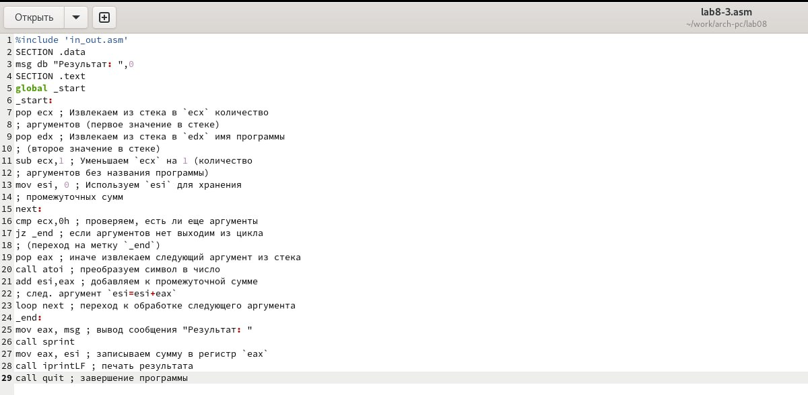{#fig:010 width=70%}

Создаю и запускаю исполняемый файл вместе с аргументами (15, 5, 8, 11, 3) (рис. [-@fig:011]). Программа действительно выдаёт сумму всех аргументов.

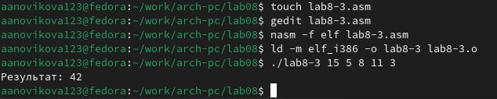{#fig:011 width=70%}

Теперь редактирую код программы так, чтобы она выводила произведение всех аргументов (рис. [-@fig:012]).

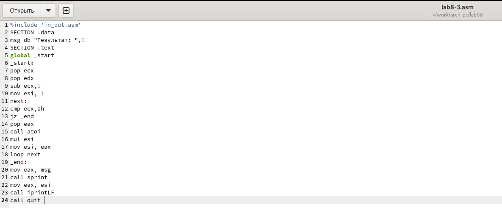{#fig:012 width=70%}

```NASM
%include 'in_out.asm'
SECTION .data
msg db "Результат: ",0
SECTION .text
global _start
_start:
pop ecx
pop edx 
sub ecx,1 
mov esi, 1 
next:
cmp ecx,0h 
jz _end 
pop eax 
call atoi
mul esi
mov esi,eax
loop next 
_end:
mov eax, msg
call sprint
mov eax, esi 
call iprintLF 
call quit 
```

Запускаю исполняемый файл вместе с аргументами (10, 5, 6, 3, 11) (рис. [-@fig:013]). Программа  выдаёт произведение всех аргументов.

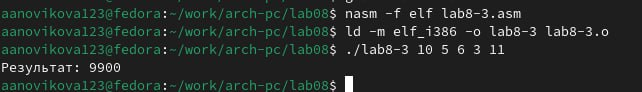{#fig:013 width=70%}

## Задание для самостоятельной работы

***ВАРИАНТ 20***

Создаю файл lab8-4.asm в котором буду писать код для последней задачи (рис. [-@fig:014])

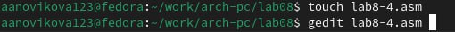{#fig:014 width=70%}

Пишу код программы, который позволяет вывести сумму всех преобразованных аргументов. Преобразования я беру из варианта задания №20 3(10 + x) (рис. [-@fig:015])

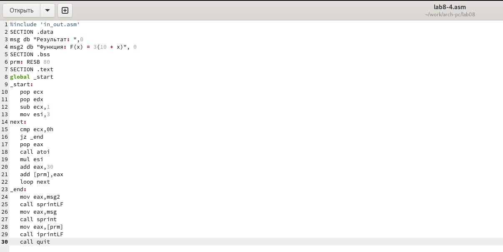{#fig:015 width=70%}

Листинг написанной программы:

```NASM
%include 'in_out.asm'
SECTION .data
msg db "Результат: ",0
msg2 db "Функция: F(x) = 3(10 + x)", 0
SECTION .bss
prm: RESB 80
SECTION .text
global _start
_start:
   pop ecx
   pop edx
   sub ecx,1
   mov esi,3
next:
   cmp ecx,0h
   jz _end
   pop eax
   call atoi
   mul esi
   add eax,30
   add [prm],eax
   loop next
_end:
   mov eax,msg2
   call sprintLF
   mov eax,msg
   call sprint
   mov eax,[prm]
   call iprintLF
   call quit
```

Запускаю исполняемый файл вместе с аргументами (1, 2, 4, 5) (рис. [-@fig:016]). Программа  выдаёт верную сумму всех преобразованных аргументов.

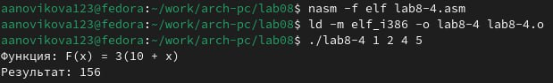{#fig:016 width=70%}

Повторно запускаю программу с другими аргументами (2, 5, 10, 11), чтобы убедиться, что всё работает верно (рис. [-@fig:017]). Программа выдает верный ответ.

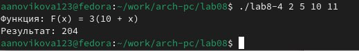{#fig:017 width=70%}

# Выводы

В ходе лабораторной работы были приобретены навыки написания программ с использованием циклов и обработкой аргументов командной строки.

::: {#refs}
:::
