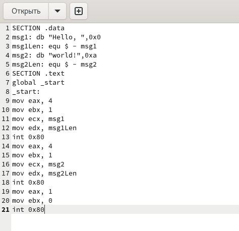
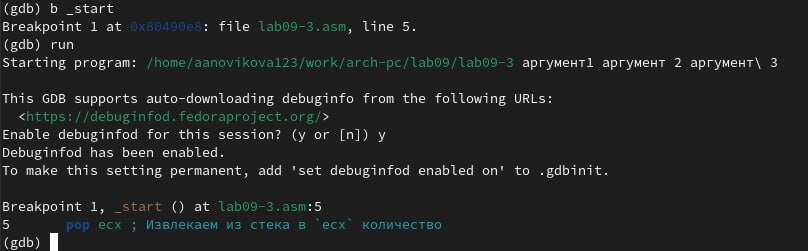

---
## Front matter
title: "Отчёт по лабораторной работе №9"
subtitle: "Понятие подпрограммы. Отладчик GDB"
author: "Новикова Анастасия Андреевна"

## Generic otions
lang: ru-RU
toc-title: "Содержание"

## Bibliography
bibliography: bib/cite.bib
csl: pandoc/csl/gost-r-7-0-5-2008-numeric.csl

## Pdf output format
toc: true # Table of contents
toc-depth: 2
lof: true # List of figures
lot: true # List of tables
fontsize: 12pt
linestretch: 1.5
papersize: a4
documentclass: scrreprt
## I18n polyglossia
polyglossia-lang:
  name: russian
  options:
	- spelling=modern
	- babelshorthands=true
polyglossia-otherlangs:
  name: english
## I18n babel
babel-lang: russian
babel-otherlangs: english
## Fonts
mainfont: IBM Plex Serif
romanfont: IBM Plex Serif
sansfont: IBM Plex Sans
monofont: IBM Plex Mono
mathfont: STIX Two Math
mainfontoptions: Ligatures=Common,Ligatures=TeX,Scale=0.94
romanfontoptions: Ligatures=Common,Ligatures=TeX,Scale=0.94
sansfontoptions: Ligatures=Common,Ligatures=TeX,Scale=MatchLowercase,Scale=0.94
monofontoptions: Scale=MatchLowercase,Scale=0.94,FakeStretch=0.9
mathfontoptions:
## Biblatex
biblatex: true
biblio-style: "gost-numeric"
biblatexoptions:
  - parentracker=true
  - backend=biber
  - hyperref=auto
  - language=auto
  - autolang=other*
  - citestyle=gost-numeric
## Pandoc-crossref LaTeX customization
figureTitle: "Рис."
tableTitle: "Таблица"
listingTitle: "Листинг"
lofTitle: "Список иллюстраций"
lotTitle: "Список таблиц"
lolTitle: "Листинги"
## Misc options
indent: true
header-includes:
  - \usepackage{indentfirst}
  - \usepackage{float} # keep figures where there are in the text
  - \floatplacement{figure}{H} # keep figures where there are in the text
---

# Цель работы

Приобретение навыков написания программ с использованием подпрограмм. Знакомство с методами отладки при помощи GDB и его основными возможностями.

# Задание

1. Реализация подпрограмм в NASM
2. Отладка программ с помощью GDB
3. Добавление точек останова
4. Работа с данными программы в GDB
5. Обработка аргументов командной строки в GDB
6. Задание для самостоятельной работы


# Выполнение лабораторной работы
## Реализация подпрограмм в NASM

Создаю каталог для выполнения работы №9 и перехожу в него(рис. [-@fig:001]).

{#fig:001 width=70%}

Копирую файл in_out.asm в созданный каталог, так как он понадобится для написания программ (рис. [-@fig:003]). 

{#fig:002 width=70%}

Создаю файл lab09-1.asm в новом каталоге (рис. [-@fig:003]).

{#fig:003 width=70%}

Открываю файл в текстовом редакторе и переписываю код программы из листинга 9.1 (рис. [-@fig:004]).

{#fig:004 width=70%}

Создаю объектный файл программы и после компановки запускаю его (рис. [-@fig:005]). Код с подпрограммой работает успешно.

{#fig:005 width=70%}

Изменяю текст файла,добавив подпрограмму sub_calcul в подпрограмму _calcul (рис. [-@fig:006]).

{#fig:006 width=70%}

```NASM
%include 'in_out.asm'
SECTION .data
msg: DB 'Введите x: ',0
result: DB '2(3x-1)+7=',0
SECTION .bss
x: RESB 80
res: RESB 80
SECTION .text
GLOBAL _start
_start:
mov eax, msg
call sprint
mov ecx, x
mov edx, 80
call sread
mov eax,x
call atoi
call _calcul ; Вызов подпрограммы _calcul
mov eax,result
call sprint
mov eax,[res]
call iprintLF
call quit
_calcul:
call _subcalcul
mov ebx,2
mul ebx
add eax,7
mov [res],eax
ret ; выход из подпрограммы
_subcalcul:
mov ebx,3
mul ebx
sub eax,1
ret
```

Запускаю исполняемый файл (рис. [-@fig:007]).Программа работает верно.

{#fig:007 width=70%}

## Отладка программ с помощью GDB

Создаю файл lab09-2.asm, используя команду touch (рис. [-@fig:008]).

{#fig:008 width=70%}

Записываю код программы из листинга 9.2,который выводит сообщение Hello world (рис. [-@fig:009]).

{#fig:009 width=70%}

Получаю исполняемый файл. Для работы с GDB провожу трансляцию программ с ключом "-g" и загружаю исполняемый файл в отладчик (рис. [-@fig:010]).

{#fig:010 width=70%}

Проверяю работу программы в оболочке GDB с помощью команды run (рис. [-@fig:011]).

{#fig:011 width=70%}

Для более подробного анализа устанавливаю брейкпоинт на метку _start,с которой начинается выполнение ассемблерной программы  (рис. [-@fig:012])

{#fig:012 width=70%}

Запускаю её (рис. [-@fig:013]).

{#fig:013 width=70%}

С помощью команды "disassemble _start" просматриваю дисассимилированный код программы (рис. [-@fig:014]).

{#fig:014 width=70%}

Переключаюсь на отображение команд с Intel’овским синтаксисом, введя команду "set disassembly-flavor intel" (рис. [-@fig:015]).

{#fig:015 width=70%}

Основное различие заключается в том, что в режиме Intel пишется сначала сама команда, а потом её машинный код, в то время как в режиме ATT идет сначала машинный код, а только потом сама команда.
 
## Добавление точек останова

Проверяю наличие точки останова с помощью команды info breakpoints (i b) (рис. [-@fig:016]).

{#fig:016 width=70%}

Устанавливаю ещё одну точку останова по адресу инструкции,которую можно найти в средней части в левом столбце соответствующей инструкции (рис. [-@fig:017]).

{#fig:017 width=70%}

Просматриваю информацию о точках останова (рис. [-@fig:018]).

{#fig:018 width=70%}

## Работа с данными программы в GDB

Выполняю 5 инструкций командой si(рис. [-@fig:019]). Во время выполнения команд менялись регистры ebx, ecx, edx, eax, eip.

{#fig:019 width=70%}

Просматриваю содержимое регистров с помощью команды info registers (рис. [-@fig:020]).

{#fig:020 width=70%}

Узнаю значение переменной msg1 по имени (рис. [-@fig:021]).

{#fig:021 width=70%}

Просматриваю значение переменной msg2 по адресу,который можно определить по дизассемблированной инструкции (рис. [-@fig:022]).

{#fig:022 width=70%}

Меняю первый символ переменной msg1 (рис. [-@fig:023]).

{#fig:023 width=70%}

Также меняю первый символ переменной msg2 (рис. [-@fig:024]).

{#fig:024 width=70%}

Вывожу значение регистра edx в различных форматах (в шестнадцатеричном, двоичном и символьном форматах) (рис. [-@fig:025]).

{#fig:025 width=70%}

С помощью команды set изменяю значение регистра ebx (рис. [-@fig:026]).

{#fig:026 width=70%}

Значение регистра отличаются, так как в первом случае мы выводим код символа 2, который в десятичной системе счисления равен 50, а во втором случае выводится число 2,представленное в этой же системе.

## Обработка аргументов командной строки в GDB

Копирую файл lab8-2.asm,созданный при выполнении лабораторной работы №8, который выводит на экран аргументы, в файл с именем lab09-3.asm (рис. [-@fig:027]).

{#fig:027 width=70%}

Создаю исполняемый файл,использую ключ --args для загрузки программы в GDB. Загружаю исполняемый файл,указав аргументы (рис. [-@fig:028]).

{#fig:028 width=70%}

Устанавливаю точку останова перед первой инструкцией в программе и запускаю её (рис. [-@fig:029]).

{#fig:029 width=70%}

Просматриваю адрес вершины стека,который хранится в регистре esp (рис. [-@fig:030]).

{#fig:030 width=70%}

Ввожу другие позиции стека- в отличие от адресов, располагается адрес в памяти: имя, первый аргумент, второй и т.д (рис. [-@fig:031]).

{#fig:031 width=70%}

Шаг изменения адреса равен 4, потому что адресные регистры имеют размерность 32 бита(4 байта).

## Задание для самостоятельной работы

***ЗАДАНИЕ 1***

Создаю файл для первого самостоятельного задания, который будет называться lab09-4.asm (рис. [-@fig:032]).

{#fig:032 width=70%}

Редактирую код программы lab8-4.asm, добавив подпрограмму, которая вычисляет значения функции f(x) (рис. [-@fig:033]).

{#fig:033 width=70%}

```Nasm
%include 'in_out.asm'
SECTION .data
msg db "Результат: ",0
msg2 db "Функция: F(x) = 3(10 + x)", 0
SECTION .bss
prm: RESB 80
SECTION .text
global _start
_start:
   pop ecx
   pop edx
   sub ecx,1
   mov esi, 0
next:
   cmp ecx,0h
   jz _end
   pop eax
   call atoi
   call _calcul
   add esi, eax ; esi = esi + eax
   loop next
_end:
   mov eax,msg2
   call sprintLF
   mov eax,msg
   call sprint
   mov eax, esi
   call iprintLF
   call quit
_calcul:
    add eax, 10     ; Добавляем 10
    imul eax, 3     ; Умножаем на 3
    ret
```
Создаю исполняемый файл и ввожу аргументы (рис. [-@fig:034]). Программа работает верно.

{#fig:034 width=70%} 

***ЗАДАНИЕ 2***

Создаю файл и ввожу код из листинга 9.3 (рис. [-@fig:035]).

{#fig:035 width=70%}

Открываю файл в отладчике GDB и запускаю программу (рис. [-@fig:036]). Программа выдает ответ 10.

{#fig:036 width=70%}

Просматриваю дисассимилированный код программы, ставлю точку останова перед прибавлением 5 и открываю значения регистров на данном этапе (рис. [-@fig:037)].

{#fig:037 width=70%}

Как можно увидеть, регистр ecx со значением 4 умножается не на ebx, сложенным c eax, а только с eax со значением 2. Значит нужно поменять значения регистров(например присвоить eax значение 3 и просто прибавит 2. После изменений программа будет выглядеть следующим образом:

```Nasm
%include 'in_out.asm'
SECTION .data
div: DB 'Результат: ',0
SECTION .text
GLOBAL _start
_start:
; ---- Вычисление выражения (3+2)*4+5
mov eax,3
mov ebx,2
add eax,ebx
mov ecx,4
mul ecx
add eax,5
mov edi,eax
; ---- Вывод результата на экран
mov eax,div
call sprint
mov eax,edi
call iprintLF
call quit
```
Пробуем запустить программу (рис. [-@fig:038]). Она работает верно.

{#fig:038 width=70%}

# Выводы

В ходе лабораторной работы были приобретены навыки написания программ с использованием подпрограмм. Также было знакомство с методами отладки при помощи GDB и его основными возможностями.


::: {#refs}
:::
