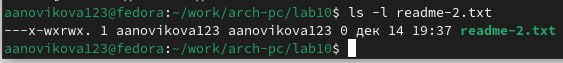

---
## Front matter
title: "Отчёт по лабораторной работе №10"
subtitle: "Работа с файлами средствами NASM"
author: "Новикова Анастасия Андреевна"

## Generic otions
lang: ru-RU
toc-title: "Содержание"

## Bibliography
bibliography: bib/cite.bib
csl: pandoc/csl/gost-r-7-0-5-2008-numeric.csl

## Pdf output format
toc: true # Table of contents
toc-depth: 2
lof: true # List of figures
lot: true # List of tables
fontsize: 12pt
linestretch: 1.5
papersize: a4
documentclass: scrreprt
## I18n polyglossia
polyglossia-lang:
  name: russian
  options:
	- spelling=modern
	- babelshorthands=true
polyglossia-otherlangs:
  name: english
## I18n babel
babel-lang: russian
babel-otherlangs: english
## Fonts
mainfont: IBM Plex Serif
romanfont: IBM Plex Serif
sansfont: IBM Plex Sans
monofont: IBM Plex Mono
mathfont: STIX Two Math
mainfontoptions: Ligatures=Common,Ligatures=TeX,Scale=0.94
romanfontoptions: Ligatures=Common,Ligatures=TeX,Scale=0.94
sansfontoptions: Ligatures=Common,Ligatures=TeX,Scale=MatchLowercase,Scale=0.94
monofontoptions: Scale=MatchLowercase,Scale=0.94,FakeStretch=0.9
mathfontoptions:
## Biblatex
biblatex: true
biblio-style: "gost-numeric"
biblatexoptions:
  - parentracker=true
  - backend=biber
  - hyperref=auto
  - language=auto
  - autolang=other*
  - citestyle=gost-numeric
## Pandoc-crossref LaTeX customization
figureTitle: "Рис."
tableTitle: "Таблица"
listingTitle: "Листинг"
lofTitle: "Список иллюстраций"
lotTitle: "Список таблиц"
lolTitle: "Листинги"
## Misc options
indent: true
header-includes:
  - \usepackage{indentfirst}
  - \usepackage{float} # keep figures where there are in the text
  - \floatplacement{figure}{H} # keep figures where there are in the text
---

# Цель работы
Приобретение навыков написания программ для работы с файлами.


# Задание
1. Задание лабораторной работы
2. Задание для самостоятельной работы


# Выполнение лабораторной работы

## Задание лабораторной работы

Создаю каталог для программ лабораторной работы №10, перехожу в него и создаю файлы: lab10-1.asm,readme-1.txt,readme-2.txt (рис. [-@fig:001]).

{#fig:001 width=70%}

Перемещаю файл in_out.asm, так как он понадобится для дальнейшей работы (рис. [-@fig:002]).

{#fig:002 width=70%}

Ввожу в файл lab10-1.asm текст программы из листинга 10.1. Чтобы программа работала, изменяю название файла, в котором будет отображаться моё сообщение (меняю readme.txt на readme-1.txt) (рис. [-@fig:003]).

{#fig:003 width=70%}

Создаю исполняемый файл, ввожу с клавиатуры сообщение, которое переместится в файл readme-1.txt, после чего распаковываю данный файл и убеждаюсь, что мое сообщение находится именно там (рис. [-@fig:004]).

{#fig:004 width=70%}

С помощью команды chmod изменяю права доступа к исполняемому файлу lab10-1, запрещая его выполнение во всех трех группах (пользователю,члену команды пользователя и всем остальным) и проверяю команду с помощью ls (рис. [-@fig:005]).

{#fig:005 width=70%}

Пробую запустить исполняемый файл, но мне отказывают в доступе (рис. [-@fig:006]).

{#fig:006 width=70%}

С помощью команды chmod изменяю права доступа к файлу lab10-1.asm с исходным текстом программы, добавляя права на исполнение для всех пользователей (рис. [-@fig:007]).

{#fig:007 width=70%}

Совершаю проверку (рис. [-@fig:008]). Так как исполняется просто файл с текстом, невозможно распознать команды, которые там прописаны.

{#fig:008 width=70%}

В соответствии с ***20 вариантом*** из таблицы (--- rw- -w-; 001 011 111) предоставляю права доступа к файлу readme-1.txt в символьном виде (рис. [-@fig:009]). А к readme-2.asm в численном (рис. [-@fig:010]).

{#fig:009 width=70%}

{#fig:010 width=70%}

С помощью команды ls и ключа -l проверяю права у 1 файла (рис. [-@fig:011]). И у 2 (рис. [-@fig:012]).

{#fig:011 width=70%}

{#fig:012 width=70%}

## Задание для самостоятельной работы

Создаю новый файл lab10-2.asm для написания кода программы (рис. [-@fig:013]).

{#fig:013 width=70%}

Пишу код программы (рис. [-@fig:014]), который работает по следующему алгоритму:

• Вывод приглашения “Как Вас зовут?”
• ввести с клавиатуры свои фамилию и имя
• создать файл с именем name.txt
• записать в файл сообщение “Меня зовут”
• дописать в файл строку введенную с клавиатуры
• закрыть файл

{#fig:014 width=70%}

```NASM
%include 'in_out.asm'
SECTION .data
    msg: DB 'Как Вас зовут? ',0
    filename: DB 'name.txt',0
    message: DB 'Меня зовут ',0
SECTION .bss
    name: RESB 80
SECTION .text
    global _start
_start:
    mov eax,msg
    call sprint
    mov ecx, name
    mov edx,80
    call sread
    mov ecx,0777o
    mov ebx,filename
    mov eax,8
    int 80h
    mov esi,eax
    mov eax,message
    call slen
    mov edx,eax
    mov ecx,message
    mov ebx,esi
    mov eax,4
    int 80h
    mov ebx,esi
    mov eax,6
    int 80h
    mov ecx,1
    mov ebx,filename
    mov eax,5
    int 80h
    mov esi,eax
    mov edx,2
    mov ecx,0
    mov ebx,eax
    mov eax,19
    int 80h
    mov eax,name
    call slen
    mov edx,eax
    mov ecx,name
    mov ebx,esi
    mov eax,4
    int 80h
    mov ebx,esi
    mov eax,6
    int 80h
    call quit
```

Запускаю программу и убеждаюсь,что она работает исправно (рис. [-@fig:015]).

{#fig:015 width=70%}


# Выводы

В ходе лабораторной работы были приобретены навыки написания программ для работы с файлами.


::: {#refs}
:::
